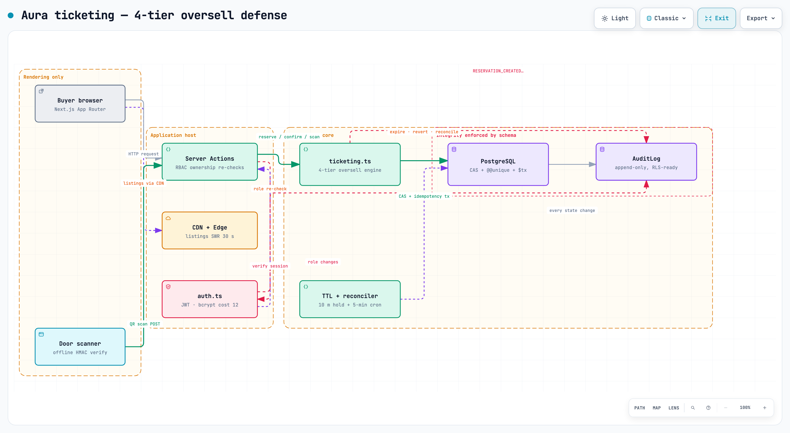

# Aura

A production-grade ticketing platform designed to demonstrate correct system design for high-demand event sales. Built on Next.js 16, Prisma ORM, and PostgreSQL, with a four-tier oversell defense that guarantees zero double-bookings even under flash-sale concurrency. Portfolio project — run it locally to kick the tyres, no public demo URL.

```text
Event → CAS write → held seat → confirm → signed QR → door scan
```

**[Read the case study](docs/CASE_STUDY.md)** — for the design, the trade-offs, and what a real flash sale will find.

[

](docs/architecture.html)

Interactive HTML view and source JSON live in [docs/architecture.html](docs/architecture.html) and [docs/diagrams/architecture.json](docs/diagrams/architecture.json). The reservation-lifecycle sequence diagram: [docs/protocol-sequence.html](docs/protocol-sequence.html) · [PNG](docs/protocol-sequence.png) · [JSON](docs/diagrams/sequence.json). Rendered with Archify.

## What it does

- **CAS-based atomic capacity writes.** `UPDATE ... WHERE ticketsIssuedCount + qty &lt;= capacity` inside a single Postgres statement, no SELECT-read-then-write, no SELECT-FOR-UPDATE deadlock window, no overticketing. See [ticketing.ts L36-47](src/services/ticketing.ts#L36-L47).
- **Per-request idempotency.** UUID `idempotencyKey` on every reserve call, backed by `Reservation.idempotencyKey UNIQUE` — double-clicks, 4G retries and retry storms never double-charge. See [schema.prisma L107](prisma/schema.prisma#L107-L107).
- **Four-tier oversell defense.** CAS write + idempotency key + `(userId, eventId, ticketIndex) @@unique` on Ticket + background reconciler. Tiers 1 and 2 stop the known races; tier 3 stops refactor bugs; tier 4 heals manual-DB-write drift. See [schema.prisma L134](prisma/schema.prisma#L134-L134).
- **10-minute held seats counted against capacity.** A reserved seat decrements availability at CAS-write time, not at confirm; `cleanupExpiredReservations` atomically reverts sold count + marks reservation EXPIRED + appends audit log. See [ticketing.ts L49-50](src/services/ticketing.ts#L49-L50) and [L164-189](src/services/ticketing.ts#L164-L189).
- **Signed JWT QR tickets.** Every ticket payload is a HS256 JWT signed by `TICKET_SECRET` in [qr.ts](src/lib/qr.ts). Forgery fails offline in the door scanner before any DB lookup; the signature check is cheap and runs in the browser worker.
- **Person-to-person ticket transfers.** `TicketTransfer` model with unique `transferCode`, pending/completed/cancelled status, receiver email, expiry window and claim flow. See [schema.prisma L137-148](prisma/schema.prisma#L137-L148) and the [transfer](src/app/api/tickets/[id]/transfer/route.ts) + [claim](src/app/api/tickets/transfer/claim/route.ts) routes.
- **RBAC with four strictly increasing roles.** `USER`, `ORGANIZER`, `ADMIN`, `SUPER_ADMIN`. Every mutating route re-checks the role from the httpOnly session cookie; ORGANIZER-owned resources additionally check `organizerId === session.userId`. See [schema.prisma L14-19](prisma/schema.prisma#L14-L19).
- **Append-only AuditLog for every state change.** `AuditLog` rows are created inside the same `$transaction` as the mutation they record; no UPDATE or DELETE on AuditLog is exposed anywhere in application code. See [schema.prisma L150-159](prisma/schema.prisma#L150-L159).
- **Buyer ↔ organizer messaging threaded per event.** `Message` model scoped by `eventId`, with read flags, unread-count endpoint, and per-conversation pages on both dashboard and organizer sides. See [schema.prisma L161-173](prisma/schema.prisma#L161-L173).
- **Organizer QR check-in, offline-capable signature verify first.** The scanner component runs `verifyTicketToken` locally before POST-ing; the `/api/organizer/checkin` endpoint re-verifies the signature and re-checks ORGANIZER ownership, then writes `Ticket.status = USED` + `validatedAt` + `validatedBy`. See [qr.ts L19-32](src/lib/qr.ts#L19-L32) and [checkin/route.ts](src/app/api/organizer/checkin/route.ts).
- **Self-healing capacity reconciler.** Runs after every TTL expiry sweep and on a 5-minute cron; sums ACTIVE reservations + ISSUED/USED tickets vs stored `ticketsIssuedCount`, writes corrective UPDATE atomically, and appends a `CAPACITY_RECONCILED` AuditLog row with old/new values and reason. See [ticketing.ts L216-266](src/services/ticketing.ts#L216-L266).
- **New-organizer onboarding: deployment-request review workflow + admin approve/reject.** Organizer-created events land as `DRAFT` with `approvedByAdmin = false`; the admin dashboard's DeploymentRequests queue lists them with Approve / Reject buttons. Approve flips both flags and publishes; Reject closes the event. Both actions write AuditLog. See [deployment-requests.tsx](src/components/admin/deployment-requests.tsx) and [action/route.ts](src/app/api/admin/events/action/route.ts).

## Run it locally

```sh
npm install
cp .sample.env .env.local
# fill DATABASE_URL, DIRECT_URL, JWT_SECRET, TICKET_SECRET, SESSION_COOKIE_NAME
# (TICKET_SECRET is used by src/lib/qr.ts — not present in .sample.env yet, add it)
npx prisma migrate dev
# optionally, to create demo users + events:
ENABLE_SEEDING=true npx prisma db seed
npm run dev            # app on http://localhost:3000
npm run build          # production build (also runs prisma generate)
npx tsc --noEmit
npm run lint
npx prisma studio      # inspect tables on http://localhost:5555
```

**Warnings:**

- Prisma `postinstall` runs `prisma generate`, which reads `DATABASE_URL` from `prisma.config.ts` via `env("DATABASE_URL")` — the variable must exist in the shell that runs `npm install`, or `prisma generate` is skipped.
- **Do NOT use SQLite.** The database is PostgreSQL-only: CAS relies on Postgres's atomic `UPDATE ... WHERE` semantics, `AuditLog.metadata` is `Json` type, and the schema's datasource is `provider = "postgresql"`.

## How it fits together

```text
src/app/                           routing, RSC, server actions
  events/                          event list, event detail, filters
  dashboard/                       ticket wallet, messages, QR manager
  admin/                           dashboard, users, audit browser, checkin
  organizer/                       dashboard, event forms, analytics, check-in
  login/ register/                 auth pages
  checkout/[id]/                   reservation → confirm flow
  profile/                         buyer profile, transfer + claim
  api/                             route handlers (auth, tickets, checkin, admin)

src/services/                      correctness core, no DOM
  ticketing.ts                     4-tier oversell engine, TTL expiry worker,
                                   self-healing capacity reconciler

src/lib/
  auth.ts                          JWT via jose, bcrypt cost 10,
                                   httpOnly SameSite cookie
  qr.ts                            TICKET_SECRET HS256 sign/verify ticket tokens
  prisma.ts                        Prisma client singleton
  utils.ts                         formatDate, formatPrice, helpers

src/components/                    rendering only; correctness lives in services
  ui/                              shadcn-style primitives
                                   (Button, Card, Input, TicketCard, StatusBadge)
  dashboard/                       QR manager, transfer modal, claim modal
  organizer/                       check-in, event forms, analytics, ticket scanner
  admin/                           moderation, deployment requests, audit browser
  events/                          filters, contact organizer dialog, featured

prisma/
  schema.prisma                    Role enum, 4x @@unique, append-only AuditLog
  migrations/                      SQL reviewed migrations

docs/
  CASE_STUDY.md                    Contra.com portfolio case study (11 sections)
  TICKETING_ARCHITECTURE.md        protocol & lifecycle v1, failure paths, 6 rules
  capacity.md                      hot-row throughput numbers, pgbench probe
  decisions/                       001-006, Context/Options/Decision/Consequences
  archify.yaml                     4-layer architecture diagram source
  diagrams/architecture.json       Archify IR for architecture diagram
  diagrams/sequence.json           Archify IR for protocol-lifecycle sequence
  architecture.html / .png         Rendered architecture diagram
  protocol-sequence.html / .png    Rendered reserve→confirm→scan→reconcile sequence
```

## Which components can write tickets, and when

| Component | Used | What it sees / can write |
| --- | --- | --- |
| Next.js app (Vercel or self-host Node) | Every request | Runs server actions; mutates only through `ticketing.ts`. Never holds signing material in JS (httpOnly cookie). |
| `ticketing.ts` ([src/services/](src/services/ticketing.ts)) | Every mutation | Only actual writer to Reservation/Ticket/counters. Wraps CAS + idempotency + inserts in one `$transaction`. |
| PostgreSQL | Every reservation / confirm / scan / expire | UNIQUE indices are schema-level (`idempotencyKey`, `ticketIndex` pairs) — final enforcer, blocks duplicates even if app code is wrong. Writes AuditLog append-only. |
| TTL reconciler (`cleanupExpiredReservations` → `reconcileCapacity`) | After every expiry sweep + 5-min cron | Reverts sold count for expired holds, detects drift, writes `CAPACITY_RECONCILED` AuditLog. Never issues new tickets. |
| Browser door scanner | Every entry | Verifies QR ticket signature offline before POST-ing; cannot write directly. Writes only via `/api/organizer/checkin` with ORGANIZER ownership re-check. |

## Things worth knowing

**CAS is not a lock — it's a write-time predicate inside the UPDATE.** Two concurrent writers race the same `UPDATE ... WHERE ticketsIssuedCount + qty <= capacity` statement; Postgres runs them serially and exactly one of them gets 1 row affected (or 0 if capacity is exhausted). There is no SELECT-FOR-UPDATE deadlock window because there is no separate read — the read is the predicate, inside the write. See [ticketing.ts L36-47](src/services/ticketing.ts#L36-L47).

**Idempotency is not deduplication.** The `idempotencyKey` UNIQUE protects one buyer retrying the same reserve on flaky 4G: same key = same reservation returned, no new write. It does *not* protect against a code refactor that calls `ticket.create` twice inside confirm with different keys. That gap is what `Ticket @@unique([userId, eventId, ticketIndex])` catches. Two different mechanisms, two different failure modes. See [schema.prisma Ticket @@unique](prisma/schema.prisma#L134-L134).

**`event.ticketsIssuedCount` is authoritative, not a derived `COUNT(*)`**, which means drift is possible. A DB admin writing a manual fix, a mid-sale admin action on the event row, or any future code path that issues a ticket without bumping the counter — all of them leave the counter wrong. The reconciler sums the real sources of truth (reservations + tickets), compares, and writes the correct value back with an AuditLog entry recording the delta and reason. It's not a sign of failure; it's the system fixing itself.

**QR tokens are signed with a separate `TICKET_SECRET` from the session's `JWT_SECRET`.** Rotate one and the other is unaffected. Rotate `TICKET_SECRET` and every old unscanned QR token is immediately invalid. Operational playbook during rotation: sign new tokens with both secrets for an overlap window, verify against both in `verifyTicketToken`, then drop the old secret once every pending ticket has either been scanned or expired.

## Deploy it

**Step 1 — Postgres.** Any managed Postgres works: Supabase, Neon, Fly Postgres, self-hosted. **SQLite absolutely does not.** See the Run it locally warnings.

**Step 2 — env.** Copy `.sample.env` to `.env.local` (or your deploy platform's env UI). Fill:
- `DATABASE_URL` + `DIRECT_URL` (from your Postgres provider)
- `JWT_SECRET`: generate with `openssl rand -hex 32` (256-bit)
- `TICKET_SECRET`: generate with `openssl rand -hex 32` (256-bit, *different* from JWT_SECRET)
- `SESSION_COOKIE_NAME`: unique per deploy so localhost/staging/prod cookies don't clobber each other

**Step 3 — migrate.** `npx prisma migrate deploy` — **NOT** `migrate dev` in production. `migrate deploy` runs the applied migrations only and never touches the shadow database or the Prisma client.

**Step 4 — seed.** ONLY on first deploy, and only with explicit `ENABLE_SEEDING=true`. Never on production after go-live: the seed script is built for local demo data and truncates if enabled.

**Step 5 — Next.js app.** Deploy on Vercel **Node runtime (NOT Edge runtime)**. Prisma client needs a real TCP socket to Postgres; server actions on Vercel Edge cannot open one. RSC + Server Actions work out of the box on Node.

**Step 6 — When you get real flash-sale traffic, in this order:**
1. Deploy PgBouncer in front, transaction pool mode.
2. CDN-cache all event listing reads (stale-while-revalidate ≤ 30s).
3. SQS FIFO queue per `eventId`, with idempotency keys riding the message key.
4. Redis shard counters (last tier, only if you've proved 1–3 aren't enough).

**Warnings:**

- `ENABLE_SEEDING`: Never enable in production. Demo seeding deletes existing user-facing data or duplicates it.
- `JWT_SECRET` / `TICKET_SECRET` leak: attacker can forge `SUPER_ADMIN` sessions *and* forge valid door-entry QR tickets. Rotate immediately, and for QR tokens write a dual-sign overlap playbook before you need it.
- Edge runtime not supported: Prisma client needs real TCP to Postgres, so server actions on Vercel Edge fail. Use Node.
- Cap signups and require organizer approval before any ticket creation runs. The deployment-request (event submission) workflow exists and defaults new organizer events to `approvedByAdmin = false` — use it.
- Run the capacity probe from [docs/capacity.md](docs/capacity.md) against **your** Postgres before your first big sale. Managed offerings differ by 3–4× in hot-row TPS.

## Status

**Working** (lint + tsc + build exit 0): CAS-based atomic capacity writes, per-request idempotency with UNIQUE key, four-tier oversell defense, 10-minute held seats with TTL expiry worker and atomic revert, HS256-signed JWT QR tickets verified offline first, person-to-person transfers with transfer codes and claim flow, RBAC across USER / ORGANIZER / ADMIN / SUPER_ADMIN with ownership enforcement, append-only AuditLog on every state change, buyer-organizer messaging threaded per event, organizer QR check-in with signature verify + DB write, self-healing capacity reconciler (TTL sweep + 5-min cron), and admin deployment-request approve/reject workflow for new organizer events.

**Measured:** 3k–8k writes/s single hot Postgres row baseline with PgBouncer transaction pooling. See [docs/capacity.md](docs/capacity.md) for the planning numbers and the pgbench probe to run on your real instance.

**Not built** (documented as the next tiers): FIFO queue per eventId behind PgBouncer, event table sharding by hash, partial refunds, waitlist auto-promotion to held seat, SSO / OAuth login, per-section or per-tier pricing within one event.

## Credits

The ticketing core — CAS write, idempotency transaction wrapping, TTL expiry worker with atomic revert, four-tier oversell defense and self-healing capacity reconciler — was written by hand. The UI redesign and pages, auth flow (register / login / httpOnly cookie session), organizer and admin dashboards, check-in scanner, event forms, messaging threads, styling and Tailwind class modernization were written with AI assistance, then reviewed and linted until the problems tab was clean, TypeScript strict was green, and ESLint had zero warnings. Design decisions were written down in [docs/decisions/](docs/decisions/) as Context / Options / Decision / Consequences at the point each was made.

## License

MIT — use freely for learning, interviews, or as a starting point for your own event platform. If this repo helped you land a role, I'd love to hear about it.
