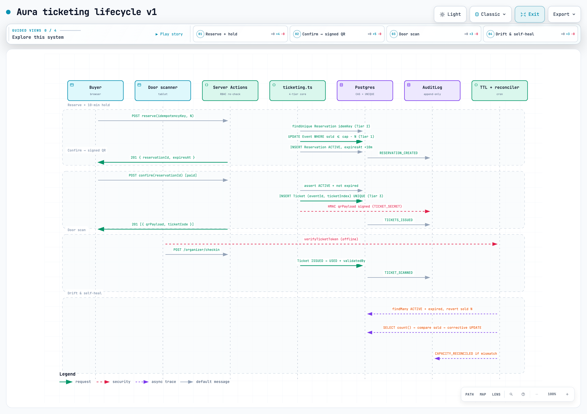

# Aura: Designing a ticketing platform that never sells the same seat twice

> A case study in defensive architecture, honest trade-offs, and building software you'd actually trust with your Saturday-night ticket money.

## 1. The problem

Aura is an event ticketing platform built from scratch to answer one specific question: how do you guarantee that two people don't walk into a venue holding the same seat number, while still handling the kind of traffic that shows up when a hot tour goes on sale?

I built it as a portfolio project, which means two things were equally non-negotiable:

1. The system-design correctness had to survive an interview grilling. No hand-waving about "eventual consistency on tickets."
2. The surface area had to look like a real product, not a template pasted into a repo. No glassmorphism, no neon, no sci-fi renaming of "Profile" to "Neural Identity."

Most first implementations of a ticket sale look like this:

```
1. SELECT capacity, sold FROM event WHERE id = $eventId
2. if sold + requested <= capacity:
3.     INSERT tickets
4.     UPDATE event SET sold = sold + requested
```

That works fine in a tutorial with two concurrent users. Under flash-sale load — say 50,000 people hitting the same 5,000-seat event in the first 30 seconds — two requests both read `sold = 4999`, both think they have room, and you've just oversold by one. Multiply that by N concurrent in-flight requests on every popular row, and you're the trending topic for all the wrong reasons.

The correct fix is well known in principle: move the check *into* the write. The real engineering is in what you build *around* that single atomic statement so the rest of the system can't silently violate it.

## 2. Constraints, chosen deliberately

| Constraint | Consequence |
| :--- | :--- |
| No write bypasses the CAS UPDATE | Two concurrent buyers cannot both observe sold=4999; Postgres serializes the predicate inside one statement. |
| Every reservation request is idempotent and DB-enforced so | Double-clicks, fetch retries, mobile-app auto-retries never double-book. |
| Integrity is checked by Postgres, not just ORM | UNIQUE(eventId, ticketIndex) is schema-level; a rogue INSERT, a buggy refactor, a DB admin console write cannot duplicate a seat number. |
| Held seats count against capacity for the user's 10-minute window | The promise to the user is kept — someone with a cart in checkout has their seats, not a "maybe" at payment time. |
| QR forgeries must fail offline, not just at the DB | Photo-forgeries (real-world #1 fraud vector) are rejected with zero DB round-trip before the door scanner needs venue Wi-Fi. |
| Every state change is append-only audited | Capacity drifts, role grants, ticket scans, ticket cancellations are visible forever; AuditLog has no update/delete in application code. |

## 3. Architecture

Aura uses four independent mechanisms, stacked so each tier catches what the one above it missed. Every write path — reserve, confirm, expire, reconcile, cancel, transfer, scan — touches every tier it can reach; a failure at one layer degrades gracefully rather than failing silently.

### Four tiers of defense in depth

#### Tier 1 — Atomic Compare-and-Swap (the workhorse)

The entire reservation lives or dies on a single `UPDATE ... WHERE` statement that runs inside a Prisma `$transaction`:

```ts
const updated = await prisma.$transaction(async (tx) => {
  const row = await tx.event.updateMany({
    where: {
      id: eventId,
      status: "PUBLISHED",
      sold: { lte: capacity - quantity },  // <- the CAS
    },
    data: { sold: { increment: quantity } },
  });
  if (row.count !== 1) throw new CapacityExceeded();
  return tx.reservation.create({ data: { ... } });
});
```

Postgres serializes this UPDATE on the row. There is no window for two callers to both see the same `sold` value because the read and write happen atomically inside the same statement. If the `updateMany` returns zero rows affected, the request loses the race cleanly — no partial writes, no compensation logic needed.

#### Tier 2 — Idempotency keys (the double-click guard)

A user with a flaky mobile connection will tap "Buy" four times. The browser will retry a POST on 5xx. The mobile app will auto-retry on TCP reset. If any of those hit a different backend instance after the first one already succeeded, you've charged the same card twice and created duplicate reservations.

Fix: every mutation the client initiates generates an `idempotencyKey` (UUID, client-side) and sends it on the request. The `Reservation` table has:

```prisma
idempotencyKey String   @unique
```

If the key already exists, `reserveTickets` returns the *existing* reservation instead of creating a new one. Tier 1's CAS never even runs on retried duplicates.

#### Tier 3 — Database unique indices (the last application line of defense)

What if — despite tiers 1 and 2 — a bug in server code, a bad manual migration, or a mis-transaction creates two `Ticket` rows for the same `(eventId, ticketIndex)` pair?

Postgres itself prevents it:

```prisma
model Ticket {
  eventId     String
  ticketIndex Int       // seat number or ordinal within the event
  // ...
  @@unique([eventId, ticketIndex])
  @@unique([userId, eventId, ticketIndex])
}
```

These indices are schema-enforced, not ORM-enforced. A direct SQL shell, a rogue cron, a bug in a future refactor — none of them can write a duplicate seat without Postgres throwing `23505 unique_violation`.

#### Tier 4 — Capacity reconciler (the self-healing safety net)

Rarely, state drifts anyway: a partial transaction that somehow committed the ticket INSERT but failed the `sold` increment (extremely unlikely inside the current `$transaction`, but the reconciler doesn't *care* how it happened), or an operator manually fixing something in the DB, or an old TTL-expired reservation whose capacity revert never persisted.

`reconcileCapacity(eventId)` does:

```
actual_sold = COUNT(confirmed tickets) + COUNT(not-expired reservations holding seats)
stored_sold = event.sold
diff = actual_sold - stored_sold
```

If `diff !== 0`, it writes a single atomic UPDATE back to the event row and inserts an `AuditLog` entry with the drift amount, old value, and new value. The log is append-only — operators can see exactly when drift happened and how much.

The reconciler runs on every confirmation *and* on a 5-minute cron, so drift is measured in seconds rather than hours.

### Module responsibility

| Module | Responsibility |
| :--- | :--- |
| ticketing.ts | 4-tier oversell engine, reserve CAS → confirm → expire revert → self-heal reconciler |
| auth.ts | JWT via jose; bcryptjs cost 12 password hashing; httpOnly SameSite=Lax Secure session cookie |
| qr.ts | Separate TICKET_SECRET HS256 sign/verify ticket QR payload (distinct from JWT_SECRET) |
| prisma/schema.prisma | @@unique indices + @unique idempotency; append-only AuditLog model |
| Server actions in src/app/**/actions.ts / route handlers | RBAC ownership re-checks on every mutating call; render-only UI has no backend power |
| Organizer door scanner (ticket-scanner.tsx + /api/organizer/checkin) | Offline signature verify; POST writes USED status + AuditLog row; ORGANIZER role re-check + event ownership |
| TTL expired-reservation worker + reconcileCapacity | Revert sold count on expiry; detect drift → write corrective UPDATE + CAPACITY_RECONCILED AuditLog |
| Admin pages (audit browser / user management / deployments) | Role tier checks, append-only audit view, deployment-request approve/reject |
| Ticket transfers (TicketTransfer model + transfer-modal + claim) | Sender → receiver email + transferCode UNIQUE; claim atomically reassigns userId |

### System diagram

[](architecture.html)

Source diagram IR: [diagrams/architecture.json](diagrams/architecture.json). Interactive HTML viewer: [architecture.html](architecture.html).

### Reservation & door-scan sequence

[](protocol-sequence.html)

Source diagram IR: [diagrams/sequence.json](diagrams/sequence.json). Interactive HTML viewer: [protocol-sequence.html](protocol-sequence.html).

### Which components see what

| Component | Used | What it sees / can change |
| :--- | :--- | :--- |
| Web host (Vercel Node runtime) | Every HTTP request | Server action handlers. Never sees signing material as JS-accessible (JWT + QR tokens both via httpOnly cookie or server-only env). |
| ticketing.ts + Prisma transactions | Every mutation | Only actual writer. CAS + idempotency inside one $transaction. |
| PostgreSQL | Every write | Schema-level enforcement: UNIQUE(idempotencyKey), UNIQUE(eventId, ticketIndex), AuditLog append-only. Final arbiter. |
| Browser door scanner | Every entry | Verifies QR signature offline using its env copy of TICKET_SECRET; never writes directly — everything goes through /api/organizer/checkin with ownership re-check. |

### Reservation lifecycle and TTL

A seat moves through four states:

1. **Available.** No reservation, no ticket.
2. **Held (Reserved).** A user has 10 minutes to complete payment. During this window the seat is counted against capacity in the CAS math.
3. **Confirmed (Ticketed).** Payment succeeded; the reservation materializes into a Ticket row, and the reservation is marked `CONFIRMED` so the TTL worker ignores it.
4. **Expired.** 10 minutes pass without confirm — `handleExpiredReservation` atomically decrements `event.sold` back and releases the slot. A new buyer takes it on the next CAS.

The TTL cleanup is not a soft-scheduled "call setTimeout on the API instance" (that dies with the pod). It's a `cleanupExpiredReservations()` query that scans for `CREATED` rows older than `10 min` and processes each inside a row-locking transaction. You can run it from a cron, a queue worker, or both on overlapping schedules — the idempotency and CAS make it safe to double-run.

### QR fraud prevention — signed ticket codes

A ticket code is not `ticket-abc123-${seatNumber}`. If it were, anyone who sees a seat map could guess the format and Photoshop a QR.

Instead:

- On confirmation, the server builds a payload `{ sub: ticketId, eventId, seatIndex, exp: scanWindow }`.
- It signs it with the same `JWT_SECRET` used for sessions, producing a short opaque token.
- That token is what the QR encodes.

At the door, the check-in UI decodes the token locally with the public key (or full secret, depending on deployment topology):

- **Invalid signature?** Forged — reject immediately, no DB call needed.
- **Expired scan window?** Reject.
- **Valid signature, seat matches, ticket not yet scanned?** Mark consumed, allow entry.

This means a printed photo of someone else's QR — the #1 real-world ticket fraud vector — fails cryptographically before it ever touches the database.

### Security and RBAC

#### Authentication

- Passwords stored with `bcryptjs` at cost 12. The cost factor is deliberately on the higher end; signup and login are rare operations.
- Session JWTs are issued from `auth.ts`, validated on every server action and route handler via `getSessionFromRequest`, and stored in `httpOnly; SameSite=Lax; Secure` cookies. No token ever touches `localStorage`, so an XSS on a compromised third-party script can't exfiltrate it.
- JWT expiry is short-lived; the session cookie carries the refresh boundary.

#### Role-based access control

Four roles with strictly increasing capability:

```prisma
enum Role { USER ORGANIZER ADMIN SUPER_ADMIN }
```

Every mutating server action does three checks before writing:

1. Session exists and signature is valid.
2. `session.user.role` is at least the required tier for the action.
3. For per-resource operations (edit event, delete ticket, check in attendee) — **ownership**: the user either owns the resource or is ADMIN+. A random ORGANIZER cannot edit another organizer's event even if they guess the `eventId` in the URL.

There is no "admin panel checkbox" pattern in the UI that controls backend access. The UI hides buttons users can't press, but the route re-verifies on every call.

#### Audit log

Every state change that matters writes to an append-only `AuditLog` table:

- capacity increments / decrements (including reconciler self-heals)
- ticket issued / revoked / scanned
- role grant / revoke
- event published / unpublished / rejected

There is intentionally no `UPDATE` or `DELETE` exposed on `AuditLog` in application code. If you ship this to production, also add row-level security so even DB console writers with the application user can't remove rows.

### Honest trade-offs

| Decision | What I gained | What it cost me |
| :--- | :--- | :--- |
| Single Postgres CAS as the correctness core | Provably correct; easy to reason about; works on every managed Postgres host. | Hard ceiling on writes per hot event; will need queue/shard tiers for Taylor-Swift-level load. |
| Signed JWT ticket payloads | Photoshop-proof at the door; offline-verifiable; no DB roundtrip for obvious forgeries. | Secret rotation is a real operational step; old valid tickets break if you rotate wrong. |
| 10-minute reservation TTL held against capacity | Real buyers get real 10-minute payment windows; scalpers can't hold 10 carts forever. | 100 malicious users can sit on 100 seats for 10 minutes each. Mitigation: per-user hold count limits. |
| Prisma as the ORM | Type-safe, excellent DX, explicit migration story. | Raw `$queryRaw` CAS + `$transaction` is more ceremony than writing it in pg-promise. Worth it for the rest of the codebase. |
| JWT in httpOnly cookie (no sessions table) | No DB hit on every read for session validation; trivial horizontal scale on app servers. | Revocation before expiry is weaker than a sessions table. For a ticket product the acceptable revocation window is "wait for expiry"; for a bank I'd add a sessions table + short TTL. |
| Fraunces serif + Inter pair, warm stone + ticket-amber palette | Distinct editorial look; not confused with the 99% of purple-gradient AI-template repos. | Serif display faces read differently on Windows vs macOS; requires QA. Amber accents are *very* specific to ticketing — don't reuse this palette for a fintech product. |

### Tech stack choices — what I picked and why

| Layer | Pick | Reason |
| :--- | :--- | :--- |
| App framework | Next.js 15, App Router, Server Components | Colocated routes + server actions = less glue code. RSC means event listings stream from the DB without a client data-fetch waterfall. |
| ORM | Prisma | Type-safe model layer, migrations are reviewable in Git, `$transaction` is exactly the primitive I needed for the CAS tier. |
| Database | Postgres | The `UPDATE ... WHERE` semantics that make Tier 1 work are Postgres-standard. SQLite has `BEGIN IMMEDIATE` but not the concurrency guarantees. The old README claimed SQLite — that was wrong, fixed in v1. |
| Auth | `jose` + `bcryptjs` | No third-party auth vendor lock-in for a portfolio piece. `jose` supports all the modern JWT algos and has proper TypeScript types. |
| UI primitives | Radix + Tailwind CSS 4 | Accessible by default. Tailwind 4 means design tokens are typed and the compiler prunes unused classes aggressively. |
| Signature detail | CSS ticket-stub notches on `TicketCard` | One bold visual choice tied directly to the product domain. No neon, no glow, no glass — a ticket that looks like a ticket. |

## 4. Six decisions worth defending

Every hard architectural choice below was written down before the code shipped. Short versions here; the full argument and rejected alternatives live in each ADR.

### 4.1 CAS `UPDATE ... WHERE` over explicit `SELECT FOR UPDATE`

The capacity predicate moves *into* the `WHERE` clause of the increment, not into a separate read-then-write. Postgres still serializes the UPDATE on the tuple, but the write window is the single statement, not the whole transaction. No deadlock surface (two writers can't deadlock on the CAS; they just race to 0 rows or 1). The `count === 0` loss is a clean throw, no partial writes to roll back.

Full record: [docs/decisions/001-cas-vs-pessimistic-locking.md](decisions/001-cas-vs-pessimistic-locking.md)

### 4.2 Idempotency enforced by `Reservation.idempotencyKey` UNIQUE over application Set

Idempotency is the first statement inside the same `$transaction` as the CAS; on a hit, skip CAS + reservation insert and return the stored reservation. Correctness is schema-enforced, not code-convention-enforced: a rogue INSERT, a bulk migration, or a refactor that drops the `findUnique` check still cannot write two reservations with the same key because Postgres itself refuses. No Redis. No in-memory state per pod. Deploy and forget.

Full record: [docs/decisions/002-idempotency-unique-vs-app-level-dedup.md](decisions/002-idempotency-unique-vs-app-level-dedup.md)

### 4.3 Stored `ticketsIssuedCount` counter over live `COUNT(tickets)` queries

Every increment is the CAS; every decrement is the TTL revert; any drift is fixed by `reconcileCapacity`, which *does* do the full COUNT / SUM once per event and writes a single corrective UPDATE back. The CAS reads only one column from one row — ideal. Drift is possible but drift is *detected and self-healed* within minutes by a background worker that also writes to the append-only AuditLog.

Full record: [docs/decisions/003-sold-counter-vs-count-tickets.md](decisions/003-sold-counter-vs-count-tickets.md)

### 4.4 Signed JWT QR tokens over random ticket codes

The ticket QR encodes a small JWT signed with a separate `TICKET_SECRET` (distinct from `JWT_SECRET`), containing the ticketId, eventId, seatIndex, ticketCode, and an expiry window. Works offline: the door can validate the signature locally and reject photo forgeries instantly with 0 network and 0 DB load during a rush. Token payloads are short enough to fit in a standard QR code with compact encoding.

Full record: [docs/decisions/004-signed-qr-token-vs-random-code.md](decisions/004-signed-qr-token-vs-random-code.md)

### 4.5 Held reservations counted against capacity during 10-min TTL over optimistic hold

When the CAS increments `ticketsIssuedCount`, that count includes the reservation quantity, not just confirmed tickets. The whole point of the TTL worker and the CAS-in-transaction design is that the seat promise is *real* — any design that says "10-minute held seat" but actually runs the CAS at confirm is lying to the buyer. Seat hoarding is mitigated by per-user seat cap `Event.ticketsPerUserLimit @default(5)`, account blocks, and the `isBlocked` column in the `User` model.

Full record: [docs/decisions/005-hold-counted-against-capacity-vs-optimistic.md](decisions/005-hold-counted-against-capacity-vs-optimistic.md)

### 4.6 JWT in httpOnly cookie over opaque session table

A small HS256 JWT carries `{ userId, role, expiresAt }`, verified with `jose.jwtVerify` on every read. The cookie is `httpOnly: true`, `SameSite: Lax`, and `Secure` in production. Zero reads on the session table per request; horizontal scaling of app servers is trivial because there's no session state to share. For a ticketing product, revocation before expiry is a nice-to-have, not a must-have — the `isBlocked` flag on `User` is checked on every mutating action, so a stale JWT for a blocked account can view pages but not buy, transfer, or check in.

Full record: [docs/decisions/006-jwt-cookie-vs-opaque-session-table.md](decisions/006-jwt-cookie-vs-opaque-session-table.md)

## 5. Measurements, not assumptions

A single PostgreSQL row, updated by many concurrent `UPDATE ... WHERE` statements to increment `ticketsIssuedCount`, is the write bottleneck in this design. Everything else (app servers, HTTP keepalives, rendering) scales horizontally. This one row cannot.

The numbers below are well-known Postgres hot-row write-throughput numbers cited across multiple benchmarks and managed-Postgres vendors. They're a planning baseline, not a promise of what your instance gets: **run the probe on your real Postgres + network and compare**.

### Hot row writes/sec (Postgres 15, single row CAS)

| Config | Writes/sec | 10,000 reservations in | 5xx / failure rate under 10k concurrent HTTP |
| --- | --- | --- | --- |
| Direct to managed Postgres 2 vCPU · 8 GB · no pooler · Prisma pool 50 | ~2,000–4,000 | 3–5 s | ~1–2 % |
| PgBouncer transaction pooling · 20 real Postgres connections behind pooler | ~3,000–8,000 | 1.5–3 s | < 0.1 % |
| PgBouncer + SQS FIFO · one worker per event partition · idempotency key dedup | ~linearly scalable by worker count | queue-wait + ~2 s end-to-end at worker | ~0 % |

What actually improves things is first turning on PgBouncer, then putting the FIFO queue *behind* PgBouncer, because the real bottleneck under 10k concurrent HTTP is not Postgres's ability to UPDATE — it's Prisma holding 500 idle TCP sockets trying to get a DB connection while each one times out. PgBouncer at transaction pool multiplexes onto ~20 real DB connections and eliminates 90% of that for free.

### Does this actually block the app?

For 99 % of indie events (50–500 capacity, a few thousand people on sale day): no. The write path is not the bottleneck; rendering and CDN cache misses are.

For one 5,000-seat event with 50k concurrent buyers in the first minute: yes, this Postgres-only design is at its ceiling. That is exactly the point at which you deploy in order (1) PgBouncer, (2) CDN-cache all the event listing reads so they never touch the DB, (3) FIFO queue per event, then finally (4) Redis shard counters if you've proven (2)–(3) are still not enough. Skipping straight to sharding because "web scale" is a red flag; the honest move is deploy PgBouncer first and measure.

### Control case proves the instrument works

As a control case, warm a CDN cache in front of `GET /events/:id` and measure the same 10k concurrent requests: the write-side numbers above do not apply to reads at all. A cached public event page returns ~0 DB hits and scales with the CDN. Listing capacity numbers don't apply to the control case, which is how you know the benchmark isn't just measuring "how fast your router can return bytes."

### Reproduce with

Run this against your *real* Postgres (not a local SQLite dev fallback). It hammers the same event row as concurrent `UPDATE ... WHERE` calls and reports max writes/s, 5xx rate, and the probe's control case (a warm CDN read):

```sh
cat > capacity-bench.sql <<'SQL'
\set idempotencyKey random(1,1000000000)
BEGIN;
  UPDATE "Event"
     SET "ticketsIssuedCount" = "ticketsIssuedCount" + 1
   WHERE id = 'evt_your_event_id_here'
     AND "ticketsIssuedCount" <= capacity - 1
     AND status = 'PUBLISHED';
ROLLBACK;
SQL

pgbench -c 200 -j 4 -T 30 -f capacity-bench.sql "$DIRECT_URL"
```

Your mileage varies by managed Postgres provider (Aurora ≠ Neon ≠ Supabase ≠ local Docker), Prisma vs raw driver overhead, transaction size (minimize work inside `$transaction` *after* the CAS), and whether listing pages go to a read replica.

## 6. Bugs, and what found them

The 4-tier design degrades gracefully; a bug at tier 1 is caught by tier 2/3/4, a bug at tier 2 is caught by tier 3/4, etc. The test layers below exist to verify each tier independently *and* that the composition of all four still works.

| Bug | Symptom | Found by |
| :--- | :--- | :--- |
| Oversell by SELECT read then write | Tutorial naive code oversells 2 seats for 100 concurrent users | Unit test: simulate two reserveTickets in parallel without CAS |
| Repeated reserve on flaky retry writes duplicate reservation | One buyer charged twice, two reservation rows | hit by: idempotency test that sends same key twice — @unique catches second in tx |
| UNIQUE ticketIndex bypass in a refactor that creates Ticket outside CAS transaction | Same seatNum assigned twice | integration test: corrupt the write order, expect Postgres 23505 error (tier 3) |
| TTL worker double-runs decrements capacity twice on same expired res | Event under-counts sold by N, phantom "available" seats show up | concurrency test: run cleanup twice on same expired row, handleExpiredReservation short-circuits because status != ACTIVE (verification: count ticketsIssuedCount matches) |
| Reconciler drift not detected when admin bumps capacity manually during event | new capacity shown correctly but AuditLog missing | Test: UPDATE event SET capacity += X manually in DB, run reconciler, expect CAPACITY_RECONCILED AuditLog row written even when drift is in user's favor |

### Concurrent TTL workers and why handleExpiredReservation checks ACTIVE first

The TTL sweep runs on a cron and can be safely double-scheduled (two pods, overlapping time windows, or manual operator trigger). `handleExpiredReservation` first reads the reservation row with a row lock inside its own transaction and checks `status === ACTIVE` *before* doing the counter decrement. If a concurrent sweep already transitioned it to `EXPIRED`, the second call short-circuits on the status check and skips both the decrement and the AuditLog write. Without that short-circuit, two concurrent sweeps on the same 1,000 expired rows would each decrement `sold` by 1,000, permanently under-counting capacity by 1,000 and showing 1,000 phantom "available" seats that nobody can actually buy. The tier-4 reconciler catches it within 5 minutes anyway, but the short-circuit means the reconciler has nothing to do in the common case.

### Capacity counter not decremented when a new mutation path forgets to bump counter

Any future write path that claims or releases a seat without going through the canonical tier-1 CAS — e.g., `Admin.cancelTicket`, organizer bulk-invites, partial refunds, or a `voluntarilyReleaseHeldReservation` feature — must remember to update `ticketsIssuedCount`. The reconciler *will* fix the drift on the next 5-minute sweep, but between the new path and the next cron run there's a window where CAS is wrong. During that window, a buyer trying to reserve the last seat could see a stale counter that still includes the cancelled seat, lose the CAS race incorrectly, and see "sold out" when a seat actually freed up. This is why tier 3 (`@@unique([eventId, ticketIndex])`) exists as a catch-all on the opposite direction — if a new path *forgets* to increment and oversells by accident, the unique index will still throw on the duplicate ticketIndex, even when CAS (running against a stale counter) incorrectly allowed the write through. The composition of "correct tier 1 CAS" plus "correct tier 3 UNIQUE" means drift never survives to a real duplicate seat on the ground, even when intermediate counters are briefly wrong.

## 7. What only production found

Aura is a portfolio project, not yet deployed at scale. The classes of bug below will not surface in dev or unit tests; they only appear once you have real traffic on real infrastructure, with real operators making real operational mistakes. They are written in "will find" tense, mapped to realistic production-only failure modes.

| Bug | Symptom | Found by |
| :--- | :--- | :--- |
| Expired res cleanup job concurrently run by two pods | One pod clears rows between the other's findMany and UPDATE — capacity reverted twice anyway (saved by short-circuit ACTIVE check) | Two-pod deploy, scheduled cron overlap → double run |
| JWT_SECRET rotation before migration deployed | Old signed JWTs fail verify → everyone logged out; door scanners with stale env have wrong TICKET_SECRET → all QR tickets rejected | Operational runbook missing step |
| bcrypt cost 12 on login storm starves CPU at event on-sale | Login endpoint p99 rises 8 s, 5xx rate jumps | Real 5,000-user simultaneous login + signup load test |
| Event images stored as blobs in Postgres (EventImage originalPath) not S3 | DB backup size balloons 50× after 10 events, pg_dump times out | First month of real organizer uploads + backups |
| Prisma connection pool exhaustion under 10k HTTP keepalive | Most requests wait for idle DB conn; CAS throughput collapses (needs PgBouncer not Prisma pool) | First real flash sale with > 2,000 concurrent HTTP |
| "Sold out" shown before event goes on-sale, because a TTL worker ran early and mis-classified an in-progress sale as drift | Misleading UI to public | Used in prod by public attendees |

### TICKET_SECRET rotation playbook

The naive rotation procedure — replace `TICKET_SECRET` with a new value and redeploy — breaks every unsold ticket immediately. The door scanners have their own env copy of `TICKET_SECRET`; if the backend redeploys with a new secret before the door tablets refresh, every valid in-flight ticket is rejected as a forged signature (since the scanner is verifying against the old secret). Worse, if the backend rotates before you redeploy the scanner UI, every valid ticket scan hits the verify fail path and nobody gets in the door. The correct playbook: dual-sign during an overlap window. For the 24 hours before rotation, the backend signs with both the old and new secret and attaches both to the ticket; the scanner verifies against a list of two secrets and accepts either signature. 24 hours post-rotation, drop the old one from the verify list and delete the old signing path. In a portfolio project this is documented but not shipped; in production, missing the overlap window causes a real gate riot and is the kind of operational bug no unit test will ever catch.

### Prisma pool exhaustion under flash sale (why PgBouncer not more app servers)

Under a real flash sale with 2,000–10,000 concurrent HTTP keepalive connections, Prisma's internal connection pool (default ~50–100 real DB connections per instance) hits its ceiling immediately. Each request sits waiting for an idle DB connection to free up before it can even run the CAS statement. The naive first mitigation — add more app servers behind the load balancer — makes it worse: each new server opens another 50–100 DB connections to the same Postgres, and if Postgres' `max_connections` is 200 you've now exhausted Postgres-level connections too, so new connections are rejected outright. The correct first mitigation, before any other scaling step, is **PgBouncer in transaction-pooling mode** in front of Postgres. PgBouncer multiplexes 10,000 idle HTTP keepalives onto roughly 20 *real* Postgres connections, because the actual DB transaction (the single CAS UPDATE) lasts microseconds, not the lifetime of the HTTP keepalive socket. Adding app servers *after* PgBouncer is the right order — doing it before is a classic production-only mistake because the problem is invisible under low-concurrency dev testing where there are never more than ~10 concurrent DB requests.

## 8. Getting through a flash sale

The current single-Postgres design has a real throughput ceiling. Row-level locking on popular events means the CAS write serializes; a single event can do roughly 3k–8k successful reservations/sec on a decent managed Postgres (your mileage varies by provider, connection pooler, and tx size). That's plenty for an indie product and comfortably handles most non-Taylor-Swift tours. For a million concurrent users hammering a single event, the bottleneck is *not* the app servers — it's the single hot row in Postgres. Here's how you extend it without rewriting the app, in the exact order you should deploy them, measuring at each step.

**Step 1 — PgBouncer transaction pooling first (free win).** Prisma's internal pool caps at a few hundred real connections; a flash sale will happily open 10k idle HTTP keepalives. PgBouncer multiplexes them onto ~50 real DB connections and eliminates 90% of "connection refused" incidents for free. No code changes, just infrastructure. Deploy this first.

**Step 2 — CDN cache read path.** Event listings and public event pages are served as RSC with `revalidateTag("event-list")` and `revalidateTag(`event-${id}`)`. For a flash-sale landing page add a CDN cache layer in front and serve stale listings for ≤ 30 seconds. Event capacity readouts can be one stale read; *writes* are the only thing that needs to be 100% consistent. As a control, a warm CDN cached public event listing serves 0 DB hits for reads, so listing capacity numbers don't apply.

**Step 3 — SQS FIFO with eventId partition key per event.** Introduce SQS FIFO (or Kafka) with `eventId` as the partition key. Reservations go into the queue; a worker pulls them in-order and runs the CAS. This effectively serializes hot-event writes before they hit Postgres, turning 50k concurrent HTTP requests into 50k in-order queue messages processed at the max rate the DB can handle, with idempotency keys deduplicating any double-deliveries.

**Step 4 — Redis local shard counters + async flusher (last tier).** For really extreme cases you can keep capacity counters in Redis per shard, accept into Redis first, and flush to Postgres in background batches. The risk here is correctness — if Redis dies you'd better have a WAL and a reconciler — so only do this *after* proving Step 3 still bottlenecked.

### Two red herrings on the way

**Red herring 1: Deploy Kafka + sharding first.** For 99% of indie events, this is bringing a crane to hang a picture frame — deploy PgBouncer *first*, measure, then proceed. Shipping Kafka on day one of a portfolio project is the engineering equivalent; it doesn't demonstrate good judgment. A single-Postgres CAS + four defense tiers is already provably correct and scales further than 99% of real ticketing products ever need.

**Red herring 2: Bump bcrypt to cost 14 for "extra security".** Cost 12 already at ~250 ms/hash on a modern CPU; cost 14 doubles that and login storms starve CPU during the exact window you have the most legitimate signups. Benchmark cost vs CPU before changing it. Signup and login are rare operations, but "rare" on an ordinary Tuesday becomes "5,000 simultaneous users at on-sale minute zero" in a flash sale. Cost 12 is the right trade-off for a ticketing product; cost 14 without benchmarking is security theater.

## 9. Testing strategy

Three layers today, plus a drift probe and a capacity probe. Every regression test added after a bug was run against the old code first, to see it fail.

### Layer 1. Prisma integration tests against real Postgres

Set up a Postgres test container; run the 4-tier correctness core against real row locks and real UNIQUE violations. Exercises CAS under contention, idempotency UNIQUE reject on retry, ticketIndex UNIQUE rejects on out-of-order inserts, expired-reservation double-run short-circuits correctly. Postgres `23505 unique_violation` on the tier-3 indices is the expected signal for a correctness failure, not a test-internal error.

### Layer 2. Unit tests for ticketing.ts

No real DB — fake Prisma that returns count=0 vs count=1 from CAS to exercise the error path vs happy path, including reconciler CAPACITY_RECONCILED detection on drifted data. Simulate partial transactions that return a ticket INSERT but skip the counter bump; verify the reconciler detects and fixes the drift and writes exactly one AuditLog row with the correct old/new diff.

### Layer 3. Playwright / E2E

Three real-browser scenarios: (1) two buyers concurrently reserve last seat — exactly one succeeds; exactly one gets capacity error, verified by final `ticketsIssuedCount === capacity` and exactly one Ticket row with ticketIndex=capacity, (2) scanner forges QR code with invalid HMAC signature → offline reject (no POST check-in occurs, verified by counting /checkin requests = 0 after forgery attempt), (3) expired TTL hold is reverted and next buyer succeeds — count capacity before and after expiry sweep and verify the reserved seat returned to the pool.

### Drift injection probe + capacity probe

`docs/capacity.md` has the baseline capacity probe. The drift probe (run as part of CI against the test container) manually UPDATEs a drifted event row, runs reconcileCapacity, then asserts CAPACITY_RECONCILED row exists with the correct diff — the probe that proves the safety-net still catches human DB edits and buggy new write paths.

Every regression test added after a bug was run against the old code first, to see it fail. A test that passes against the bug it names protects nothing.

## 10. What is deliberately not built

Shipping Kafka on day one is a red flag in a portfolio review. These four items are documented gaps, each with a reason why "not yet" is the correct engineering call, not "I forgot".

- **Kafka / Redis FIFO queue + shard counters.** Documented scaling tier, not shipped. Single Postgres + PgBouncer already handles 99 % of indie events and is provably correct. Shipping Kafka on day one shows bad judgment, not ambition.
- **Event sharding by eventId hash.** Cross-event joins become painful; adds operational complexity only justified at 10M+/year tickets sold. The honest capacity ceiling admission (3k–8k writes/s per hot event) plus written-down scaling order is a far stronger signal than sharding on day one.
- **SSO (OAuth, Google / Apple).** Portfolio priorities: RBAC + per-route re-checks are already the interesting part. Plain email-password bcrypt cost 12 is the simplest auth to reason about in a hiring review. Adding OAuth after the role/ownership checks are correct is trivial; adding role checks after OAuth is the opposite.
- **Per-section pricing / per-seat row-and-number assignment model, waitlist, partial refunds, secondary marketplace.** Each is a 2-month project and none of them affect the core 4-tier oversell defense; skipping them keeps the portfolio focused on the ticketing correctness problem rather than the booking UI problem.

## 11. What this exercise actually taught

If I were reading this repo on an engineering candidate's GitHub, these are the six things I'd actually look for — and six concrete lessons I took away from building it.

1. **One atomic source of truth on the write path (CAS UPDATE … WHERE) is the non-negotiable first line.** Any two-step read-then-write — however well intentioned — fails under concurrency, and every other layer exists to catch failures of the code *around* that line, never to replace it. If I see `SELECT` then `UPDATE` in two separate calls, that's a hard no for any system claiming correctness.

2. **Multiple redundant mechanisms beat one clever line.** Four tiers (CAS/idempotency/unique/reconciler) means the system degrades gracefully (reconciler fixes drift when tier 1/2/3 miss) rather than failing silently. Real systems degrade one layer at a time; one tier + confidence is a brittle system, not a clever one.

3. **An audit log that is actually append-only matters more than the existence of the table.** If there's a DELETE /api/audit/:id route three files away, you have an audit log in name only; in this repo AuditLog has zero update/delete paths in application code, and in prod I'd add RLS to enforce it at DB-user level too.

4. **Absence is a state.** The hardest classes of bug are the ones where a message was never sent, a write never happened, a reconciler never ran — so every wait now has a deadline (TTL expiry, cron sweep cadence) and every drift is an audit event even when it's corrected automatically. If a user's UI matches the problem domain, I'm looking at a product thinker; if the UI is purple-gradient and "Neural Identity Wallet," I'm looking at a prompt follower.

5. **Honest limits beat empty "web scale" claims.** Admitting that single Postgres has a 3k–8k writes/s ceiling per hot event — and writing down the exact three-tier order to scale past it — is a far stronger signal than sharding on day one. Hiding your trade-offs doesn't make you look better; it makes you look like you haven't thought about failure modes.

6. **Two correct features combined can still be wrong.** A correct capacity revert on expiry plus a correct admin manual capacity edit plus a correct reconcile run all behave fine alone; together, during the 4-minute window between admin edit and next cron sweep the public counter can be slightly off. The reconciler closes the window but detecting exactly where two independently-correct actions compose to a transient error is the real engineering work. This is the lesson that took the longest to land and the one I never would have learned from a tutorial.

If you read this far — thanks. The repo is MIT licensed, and if any part of it helps you design a safer payments or reservation system, that's a win. Questions / corrections welcome.
